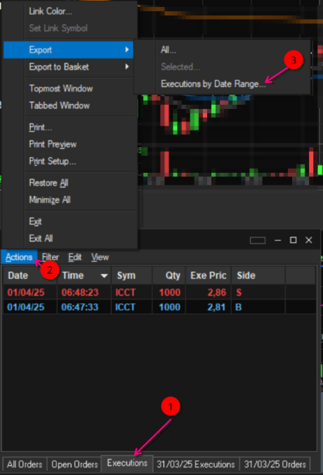
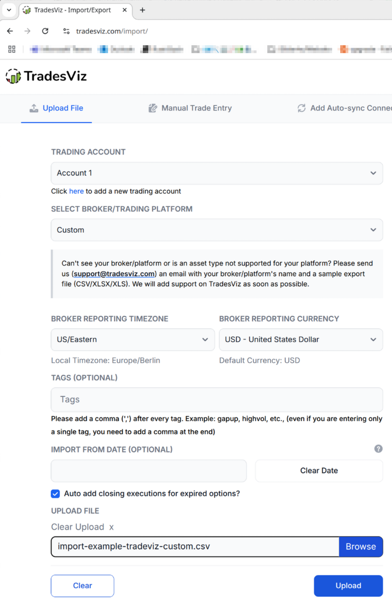

<p align="center">
  
</p>

# Sterling Trader zu TradesViz Konverter

[](https://github.com/eddi888/convert-sterlingtrader2tradesviz/actions/workflows/ci.yml)
[](https://github.com/eddi888/convert-sterlingtrader2tradesviz/releases)

Ein Kommandozeilen-Tool, geschrieben in Rust, das Sterling Trader Exportdateien in das TradesViz-Format konvertiert.

## Features

- Konvertiert Sterling Trader CSV-Exporte in das TradesViz-Format
- Automatische Erkennung und Entfernung von BOM (Byte Order Mark)
- Bereinigung von Nullbytes
- Detaillierte Fehlerbehandlung und Validierung
- Verbose-Modus für detaillierte Ausgaben
- Automatische oder benutzerdefinierte Ausgabedateien

## Installation

### Download

Sie können die vorkompilierte Version für Ihr Betriebssystem von der [Release-Seite](https://github.com/eddi888/convert-sterlingtrader2tradesviz/releases) herunterladen:

- Windows: `mutate-windows-amd64.exe`
- Linux: `mutate-linux-amd64`
- macOS: `mutate-macos-amd64`

### Build aus dem Quellcode

Alternativ können Sie das Programm auch selbst kompilieren:

#### Voraussetzungen

- Rust und Cargo (Installation via [rustup](https://rustup.rs/))

#### Build

```bash
git clone https://github.com/eddi888/convert-sterlingtrader2tradesviz.git
cd convert-sterlingtrader2tradesviz
cargo build --release
```

Das kompilierte Programm finden Sie unter `target/release/mutate`.

## Verwendung

### Grundlegende Verwendung

```bash
./mutate EINGABEDATEI [OPTIONEN]
```

### Optionen

- `-o, --output <DATEI>`: Ausgabedatei (Optional, Standard: `<eingabe>.txt.cust.csv`)
- `-v, --verbose`: Zeigt detaillierte Informationen während der Konvertierung
- `-h, --help`: Zeigt die Hilfe an
- `-V, --version`: Zeigt die Version an

### Beispiele

```bash
# Einfache Konvertierung
./mutate trades.txt

# Mit benutzerdefinierter Ausgabedatei
./mutate trades.txt -o output.csv

# Mit detaillierter Ausgabe
./mutate trades.txt -v
```

## Beispieldateien

Im Verzeichnis `example-csv-files` finden Sie Beispieldateien:

- `export-example-sterling-trader.txt`: Eine Beispiel-Exportdatei aus Sterling Trader
- `import-example-tradeviz-custom.csv`: Eine Beispiel-Zieldatei im TradesViz-Format

Diese Dateien zeigen das erwartete Ein- und Ausgabeformat und können zum Testen verwendet werden.

## Sterling Trader Export

Um Ihre Trades aus Sterling Trader zu exportieren:

1. Öffnen Sie Sterling Trader Pro
2. Gehen Sie zu "Trade Reports" -> "Executions"
3. Wählen Sie den gewünschten Zeitraum
4. Klicken Sie auf "Export"
5. Speichern Sie die Datei mit der Endung `.txt`



## Eingabeformat

Das Tool erwartet Sterling Trader CSV-Exporte in einem der folgenden Formate:

### Format mit Dezimalstellen (7 Spalten)
```
Datum,Zeit,Symbol,Menge,Preis_Ganzzahl,Preis_Dezimal,Typ
01/04/25,09:30:00,AAPL,1000,150,50,B
```

### Format ohne Dezimalstellen (6 Spalten)
```
Datum,Zeit,Symbol,Menge,Preis_Ganzzahl,Typ
01/04/25,09:30:00,AAPL,1000,150,B
```

Hinweise:
- Datum: Format DD/MM/YY
- Zeit: Format HH:MM:SS
- Preis: Bei 7 Spalten werden Ganzzahl und Dezimalstellen kombiniert (z.B. "150,50" wird zu "150.50")
- Typ: B = Buy (Kauf), S = Sell (Verkauf)


Beispiel:
```
01/04/25,09:30:00,AAPL,1000,150,50,B
01/04/25,09:35:00,AAPL,500,151,25,S
```

- Datum: `DD/MM/YY` Format
- Zeit: `HH:MM:SS` Format
- Symbol: Aktien-/Handelssymbol
- Menge: Ganzzahl
- Preis: Aufgeteilt in Ganzzahl und Dezimalstellen
- Typ: 'B' für Kauf (Buy), 'S' für Verkauf (Sell)

## Ausgabeformat

Das Tool generiert CSV-Dateien im TradesViz-Format:

### Import in TradesViz

Die konvertierte Datei kann in TradesViz wie folgt importiert werden:

1. Gehen Sie zu "Import" -> "Import Custom CSV"
2. Wählen Sie die konvertierte `.txt.cust.csv` Datei
3. Wählen Sie das Format "Custom CSV 1"
4. Klicken Sie auf "Import"



Die Spalten sind bereits im korrekten Format:
```
date,time,symbol,asset_type,price,currency,quantity,commission,tags,notes
YYYYMMDD,HH:MM:SS,SYMBOL,stock,PREIS,USD,MENGE,0.0,,
```

- Datum wird zu `YYYYMMDD` konvertiert
- Preise werden kombiniert (z.B. "150" und "50" wird zu "150.50")
- Mengen bei Verkäufen werden negativ
- Asset-Type ist immer "stock"
- Währung ist immer "USD"
- Commission wird auf "0.0" gesetzt
- Tags und Notes bleiben leer

## Entwicklung

### Projektstruktur

```
convert-sterlingtrader2tradesviz/
├── src/
│   └── main.rs              # Hauptprogramm
├── site/                   # Dokumentationsbilder
│   ├── sterling-trader-executions-export-example.png
│   └── tradesvis-import-custom-example.png
├── example-csv-files/      # Beispieldateien
│   ├── export-example-sterling-trader.txt
│   └── import-example-tradeviz-custom.csv
├── Cargo.toml              # Projektabhängigkeiten
├── LICENSE                 # BSD 3-Clause License
└── README.md              # Diese Datei
```

### Abhängigkeiten

- `csv`: CSV-Datei Verarbeitung

## Community

### Mitwirken

Wir freuen uns über Beiträge! Bitte lesen Sie unseren [Contributing Guide](CONTRIBUTING.md) für Details.

### Bug Reports & Feature Requests

- Gefundene Bugs können Sie über den [Issue Tracker](https://github.com/eddi888/convert-sterlingtrader2tradesviz/issues/new?template=bug_report.md) melden
- Feature-Vorschläge können Sie über den [Issue Tracker](https://github.com/eddi888/convert-sterlingtrader2tradesviz/issues/new?template=feature_request.md) einreichen

### Support

Wenn Sie Hilfe benötigen oder Fragen haben, können Sie:
- Ein [GitHub Issue](https://github.com/eddi888/convert-sterlingtrader2tradesviz/issues) erstellen
- Die [Dokumentation](README.md) lesen
- `clap`: Kommandozeilen-Argument-Parser
- `anyhow`: Fehlerbehandlung
- `tempfile`: Temporäre Dateien für Tests

### Tests

Das Projekt enthält umfangreiche Tests:

```bash
cargo test
```

#### Unit Tests
- `test_convert_date`: Testet die Datumskonvertierung
- `test_convert_price`: Testet die Preisformatierung
- `test_convert_quantity`: Testet die Mengenumwandlung

#### Integrationstests
- `test_full_conversion`: Testet den gesamten Konvertierungsprozess

## Lizenz

Dieses Projekt steht unter der [BSD 3-Clause License](LICENSE).

Copyright (c) 2025, eddi888. Alle Rechte vorbehalten.

## Beitragen

Beiträge sind willkommen! Bitte erstellen Sie einen Pull Request oder ein Issue.

## Kontakt

[Ihre Kontaktinformationen]
